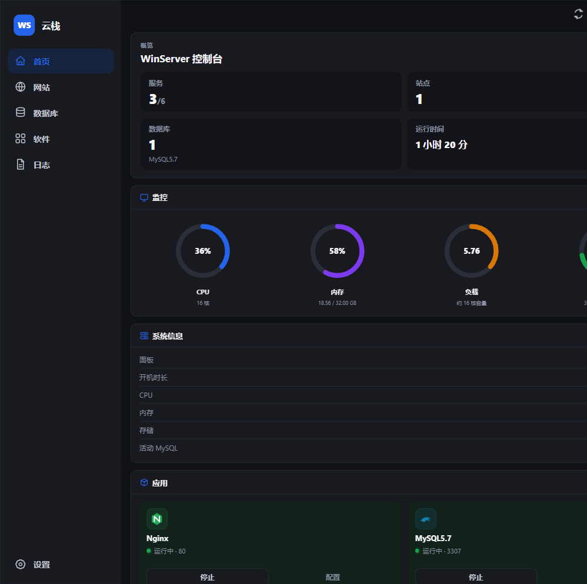
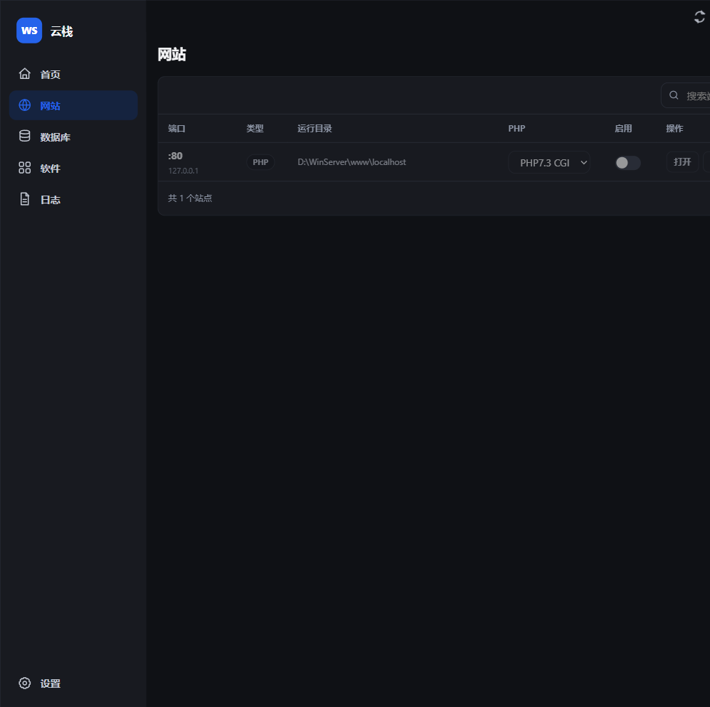
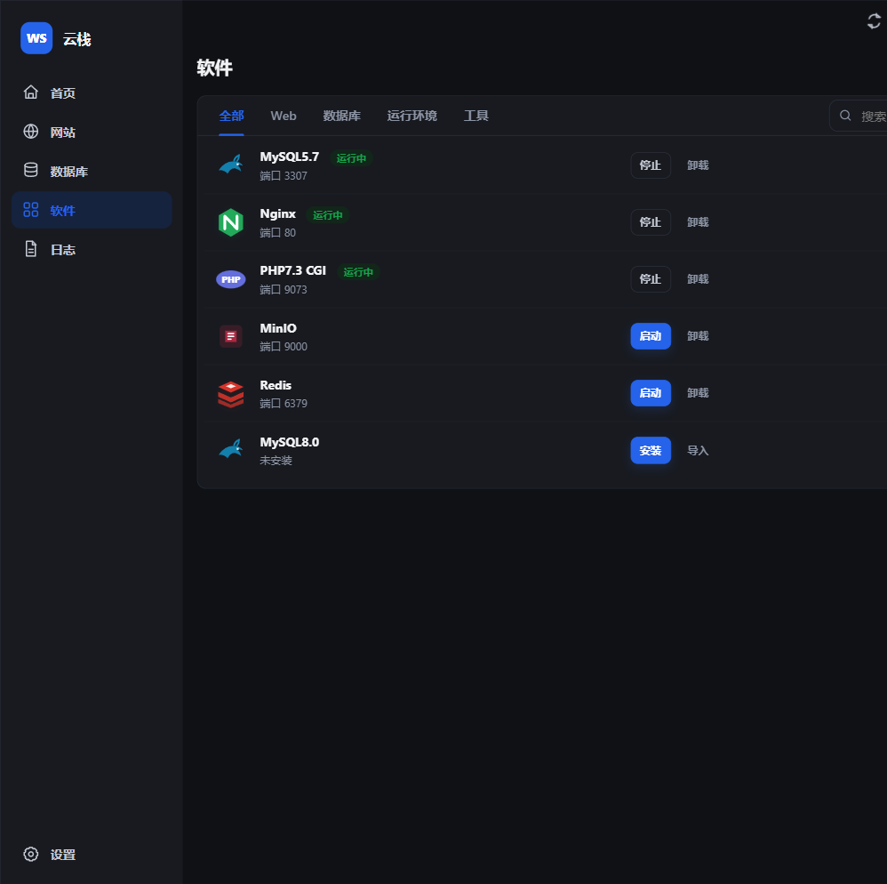
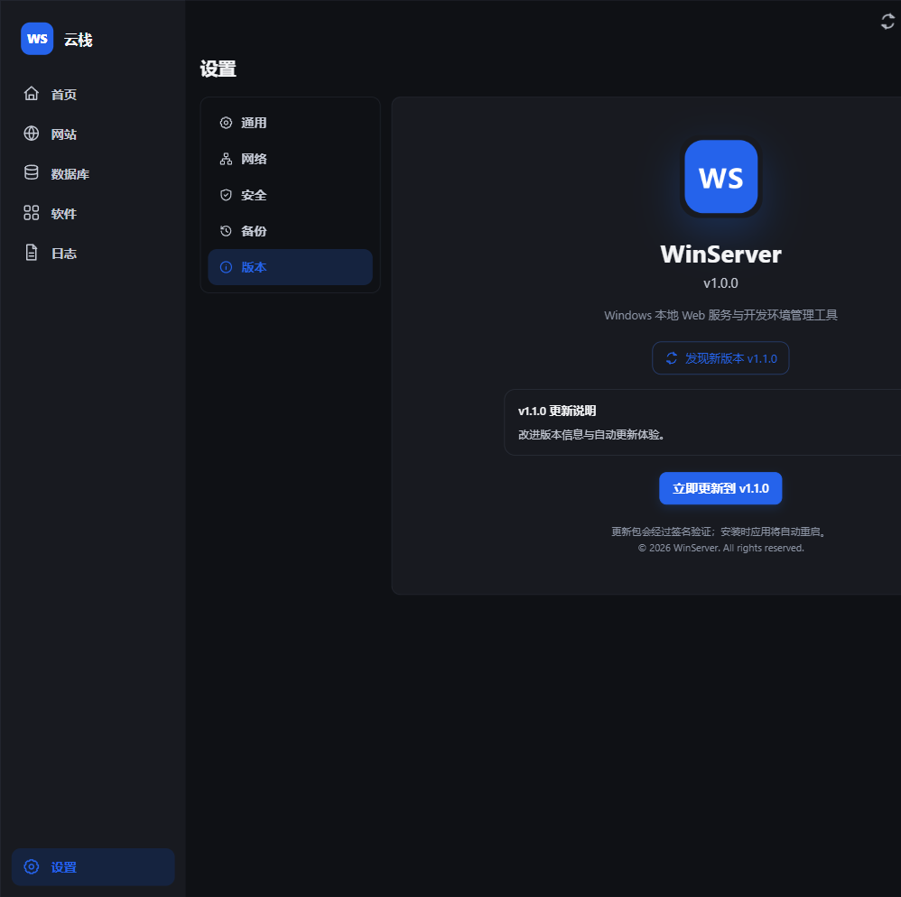
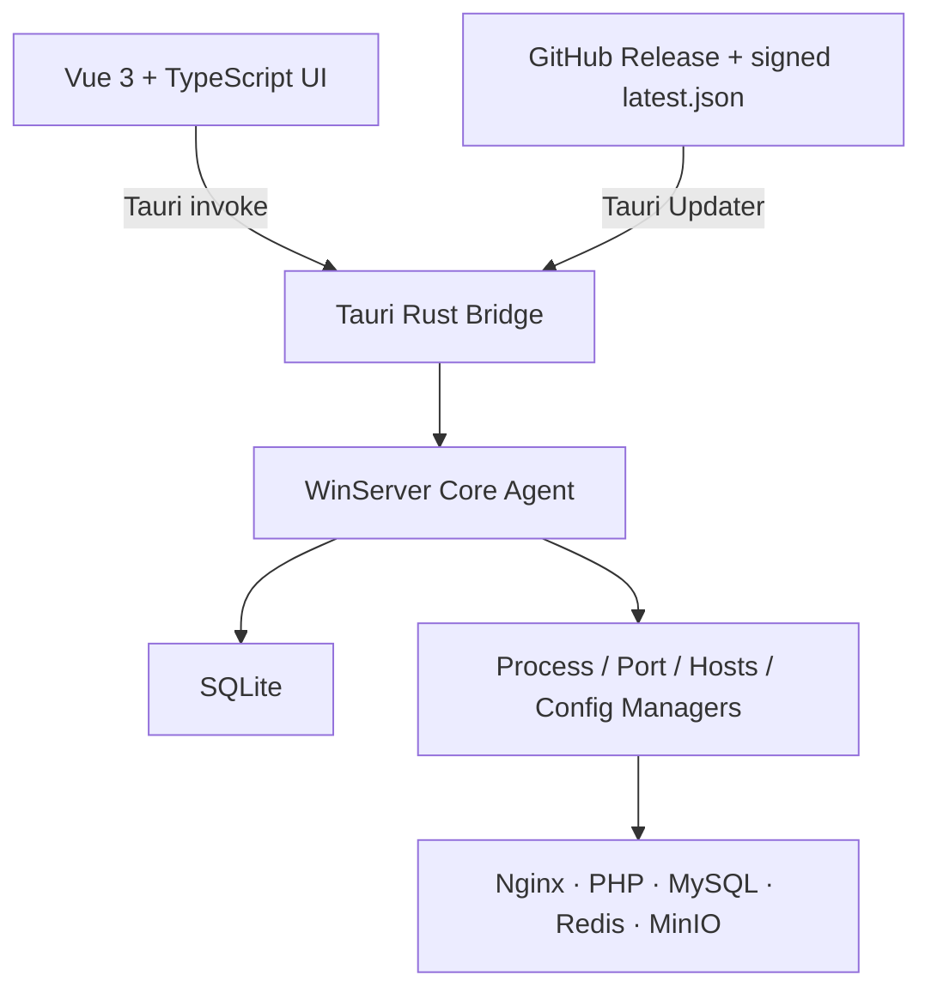

<div align="center">
  

  # WinServer

  **面向 Windows 的本地 Web 开发环境与服务管理桌面应用**

  用一个现代化控制台管理 Nginx、PHP、MySQL、Redis、MinIO、站点、配置和日志。

  [](https://github.com/beidaomitu233/winserver/actions/workflows/ci.yml)
  [](https://github.com/beidaomitu233/winserver/actions/workflows/release.yml)
  [](https://github.com/beidaomitu233/winserver/releases/latest)
  [](https://v2.tauri.app/)
  [](https://vuejs.org/)
  [](https://www.rust-lang.org/)

  [下载安装](https://github.com/beidaomitu233/winserver/releases/latest) · [使用与验收](docs/验收文档.md) · [项目文档](docs/PROJECT_DOCUMENT.md) · [参与开发](#参与开发)
</div>

---

## WinServer 是什么

WinServer 是一个类似 phpStudy 的 Windows 本地服务面板，目标是让开发者不必手动维护多套启动脚本、端口和配置文件，即可完成本地 Web 环境的安装、启停、建站、诊断和升级。

界面由 Vue 3 驱动，系统操作集中在 Rust/Tauri 层。前端不会直接执行任意 Shell 命令，服务状态、配置写入和本地数据通过受控接口管理。

## 功能概览

| 能力 | 说明 |
| --- | --- |
| 服务控制台 | 查看服务状态、端口和系统资源，单独或一键启停核心服务 |
| 网站管理 | 创建和管理本地站点、运行目录、端口、hosts 映射及 PHP runtime |
| 数据库管理 | 管理本地 MySQL 数据库、账号、密码及导入导出流程 |
| 软件与 runtime | 管理 Nginx、PHP、MySQL、Redis、MinIO，支持内置安装与本地导入 |
| 配置与诊断 | 编辑受控配置文件、检查端口、查看与筛选日志 |
| 配置备份 | 导入导出应用设置、查看和删除数据库备份 |
| 自动更新 | 在“设置 → 版本”检查更新，签名验证后下载安装并自动重启 |

## 软件截图

### 控制台与系统监控



### 站点管理



### 软件与运行环境



### 签名自动更新



> 截图使用开发预览数据，不包含真实用户凭据或生产配置。

## 安装与升级

### 安装要求

- Windows 10/11 x64
- Microsoft Edge WebView2 Runtime（多数现代 Windows 已内置）
- 运行 Nginx、MySQL 或修改 hosts 时，系统可能请求相应权限

### 安装

1. 打开 [GitHub Releases](https://github.com/beidaomitu233/winserver/releases/latest)。
2. 下载 `WinServer_<版本>_x64-setup.exe`。
3. 运行安装程序并启动 WinServer。

安装包内包含项目约定的基础 runtime 资源，因此文件体积会大于普通桌面客户端。

### 自动升级

打开“设置 → 版本”。当 GitHub Release 中存在更高版本时，应用会显示版本号和更新说明。点击“立即更新”后，客户端将下载更新、验证签名、覆盖安装并重新启动。签名或网络校验失败时不会执行安装。

完整发布与更新验证流程见 [自动更新发布说明](docs/AUTO_UPDATE_RELEASE.md)。

## 技术架构



| 层级 | 技术 | 职责 |
| --- | --- | --- |
| 桌面界面 | Vue 3、TypeScript、Pinia、Vite | 页面、状态与用户交互 |
| 桌面桥接 | Tauri 2、Rust | 权限边界、应用生命周期、自动更新 |
| 核心 Agent | Rust、Tokio | 服务、进程、端口、站点、runtime 和配置管理 |
| 本地存储 | SQLite / rusqlite | 设置、站点、服务、runtime、日志与业务记录 |
| 测试 | Cargo Test、Playwright | 单元、集成、资源与页面回归 |

架构与业务链路详见 [architecture.md](docs/architecture.md) 和 [PROJECT_DOCUMENT.md](docs/PROJECT_DOCUMENT.md)。

## 项目目录

```text
winserver/
├─ agent/                  # Rust Core Agent、数据库与业务管理器
│  ├─ src/database/        # SQLite 连接、schema 与数据访问
│  ├─ src/managers/        # 服务、站点、runtime、端口、hosts、配置
│  ├─ src/server/          # 请求路由与本地通信
│  └─ tests/               # Agent 集成和验收测试
├─ frontend/               # Vue 3 + Tauri 桌面应用
│  ├─ src/pages/           # 首页、站点、数据库、软件、日志、设置
│  ├─ src/components/      # 布局与通用弹窗
│  ├─ src/stores/          # Pinia 状态与自动更新 store
│  ├─ src/dev/             # 浏览器开发环境的 Tauri mock
│  └─ src-tauri/           # Tauri 配置、Rust bridge、权限与图标
├─ shared/                 # Agent 与桌面端共享的 Rust 类型和协议
├─ runtime/                # 安装包携带的第三方 runtime 资源
├─ tests/e2e/              # Playwright 端到端测试
├─ docs/                   # 架构、验收、GitFlow、发布和截图
└─ .github/workflows/      # CI 与签名 Release 工作流
```

## 本地开发

### 环境准备

- Windows 10/11
- Node.js 20+
- Rust stable（MSVC toolchain）
- Visual Studio 2022 Build Tools / C++ 桌面构建工具
- WebView2 Runtime

### 启动桌面应用

```powershell
git clone https://github.com/beidaomitu233/winserver.git
cd winserver

cd frontend
npm ci
npm run tauri dev
```

只调试前端页面时可以运行：

```powershell
cd frontend
npm run dev
```

浏览器开发模式会使用 `frontend/src/dev/tauriMock.ts` 提供可重复的预览数据，不会直接操作系统服务。

## 构建与测试

```powershell
# Rust workspace
cargo test --workspace --all-targets
cargo clippy --workspace --all-targets --all-features -- -D warnings

# 前端类型检查和生产构建
cd frontend
npm ci
npm run build

# 回到仓库根目录执行 runtime 资源检查和 E2E
cd ..
node tests/verify-runtime-resources.js
npx playwright test
```

构建 Windows 安装包：

```powershell
cd frontend
npm run tauri build
```

正式发布构建需要 updater 私钥，详见 [AUTO_UPDATE_RELEASE.md](docs/AUTO_UPDATE_RELEASE.md)。

## 参与开发

本项目强制使用适配版 GitFlow：

- `main`：稳定生产线，只接受 `release/*` 和 `hotfix/*`
- `develop`：下一版本集成线
- `feature/*`、`bugfix/*`：从 `develop` 创建并通过 PR 合回
- `release/*`、`hotfix/*`：合入 `main` 后必须回灌 `develop`

开始一个功能：

```powershell
git checkout develop
git pull
git checkout -b feature/your-topic
```

提交使用 Conventional Commits，例如：

```text
feat(site): add local domain validation
fix(agent): serialize service start requests
docs(release): clarify updater publishing flow
```

提交 PR 前请阅读：

- [AGENTS.md](AGENTS.md)
- [GitFlow 规范](docs/GITFLOW.md)
- [发布与合并检查清单](docs/RELEASE_CHECKLIST.md)
- [PR 模板](.github/pull_request_template.md)

## 安全说明

- 不要提交 updater 私钥、数据库密码、本机凭据或包含用户数据的日志。
- updater 私钥仅存放于安全备份和 GitHub Actions Repository Secret。
- 删除、配置写入和 runtime 安装相关变更必须覆盖失败回滚与历史数据场景。
- 若发现安全问题，请先通过仓库维护者的私密渠道报告，不要在公开 Issue 中披露凭据或可利用细节。

## 文档索引

| 文档 | 内容 |
| --- | --- |
| [PROJECT_DOCUMENT.md](docs/PROJECT_DOCUMENT.md) | 业务模块、状态流转与接口协作原则 |
| [architecture.md](docs/architecture.md) | 技术架构和长期设计 |
| [验收文档.md](docs/验收文档.md) | 功能验收路径 |
| [GITFLOW.md](docs/GITFLOW.md) | 分支、合并、tag 与红线 |
| [RELEASE_CHECKLIST.md](docs/RELEASE_CHECKLIST.md) | 集成级和发版级检查项 |
| [AUTO_UPDATE_RELEASE.md](docs/AUTO_UPDATE_RELEASE.md) | 签名更新与 GitHub Release 发布流程 |

---

<div align="center">
  如果 WinServer 对你有帮助，欢迎提交 Issue、PR 或为项目点亮 Star。
</div>
